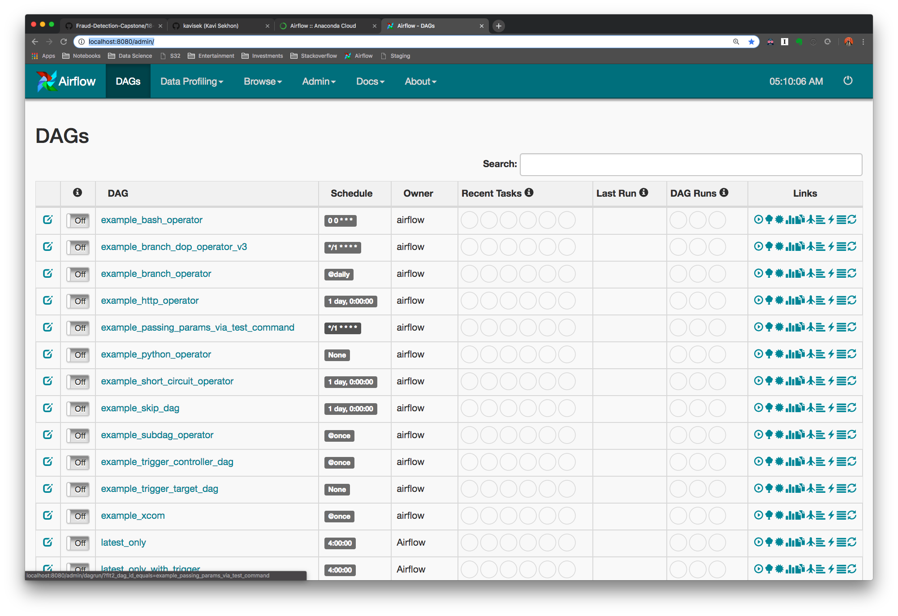

# Automating Workflows with Airflow

Apache Airflow is a like a crontab on steroids. Its a pipeline framework that can be used for ETL processing and model training if your are dealing with very large complex setups. The framework allows you to run multiple jobs across different workers. I have a simple implementation of Airflow running on my local machine with the airflow server and meta database running in docker containers. If you want to set up an instance on your local machine use this small tutorial.

After setting up the docker containers the airflow server will start running some example DAGs with I have written.

### Versions

- Airflow = 1.10.3
- Postgres Database =  9.6.15

### Setting up Postgres database

First I will need to start a Postgres server in a docker container on my local machine. This will Postgres container will store our meta-database for our airflow-server.


```bash
# Creating postgres docker container
docker run -d --name my_postgres -v my_dbdata:/var/lib/postgresql/data -p 54320:5432 postgres:11


# Connect to the postgres database
docker exec -it my_postgres psql -U postgres

# Check the current version of Postgres
SHOW server_version;

# Disconnect from postgres server
\q
```


### Local Airflow Setup Instructions

1. Create a virtual environment using conda.

```
conda create -n airflow python=3.6
```

2. Activate and enter your new virtual environment

```
source activate airflow
```

2. Conda install `pip` and environment

```
conda install -c anaconda pip
```

4. Start the Airflow web server.

`airflow webserver -p 8080`

5. Start the Airflow scheduler

`airflow scheduler`

6. Visit "http://localhost:8080/admin/" to view the Airflow Dashboard to run your DAGs




### Airflow Command Line

Use this command to set a dag to be completed without running it
```bash
airflow run the_pipeline run_task 2019-07-27 -m
```

Use this command to set a backfill dags to be completed without running it
```bash
airflow backfill the_pipeline -s 2019-07-27 -e 2019-07-20 -m  --dry_run
```

There will be time when I take the airflow scheduler down for testing and updates. When I start dhe scheduler up again I don't want it to start bacfill automatically because I don't ant it pining our API all the time.

Therefore I will use backfill to start populate the database a date range of "marked success fulljob."

```bash
airflow backfill the_mark_pipeline -s 2019-07-27 -e 2019-07-30 -m --verbose
```


### General Notes

As I learn more through my experimentation. I will be adding to these notes below.

- You can modify Airflow paths and DAG locations in the Airflow config file.
- If you are running bash script using the Bash Operator place an extra space at the end of the Python script.
- If you modify or add a DAG to Airflow, it can take up to 5 minutes so show up in the web server.
- If you change the name of a DAG, unlink the DAG in Airflow before renaming it within the Python file.


### Sources

- [Airflow Documentation](https://airflow.apache.org/)
- [Postgres Docker Container Setup](https://www.saltycrane.com/blog/2019/01/how-run-postgresql-docker-mac-local-development///)
